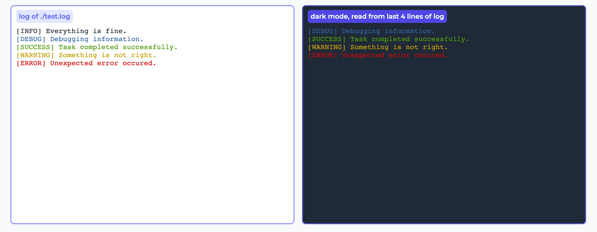

# `gradio_log`
<a href="https://pypi.org/project/gradio_log/" target="_blank"></a>  

A Log component of Gradio which can easily continuously print any log file content into the user interface.

> Credit: [Featurize 算力平台](https://featurize.cn)




## Installation

```bash
pip install gradio_log
```

## Usage

```python
import gradio as gr
from gradio_log import Log

log_file = "/path/to/your/log_file.txt"

with gr.Blocks() as demo:
    Log(log_file, dark=True, xterm_font_size=12)

if __name__ == "__main__":
    demo.launch()
```

After launched, try to add some new logs into the log file, and you will see the new logs are printed in the user interface.
